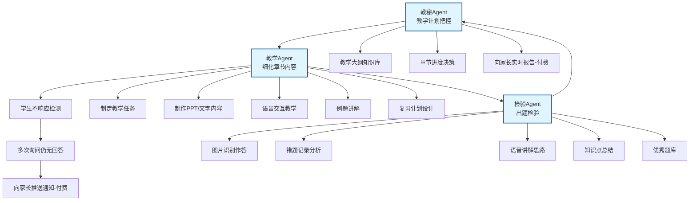
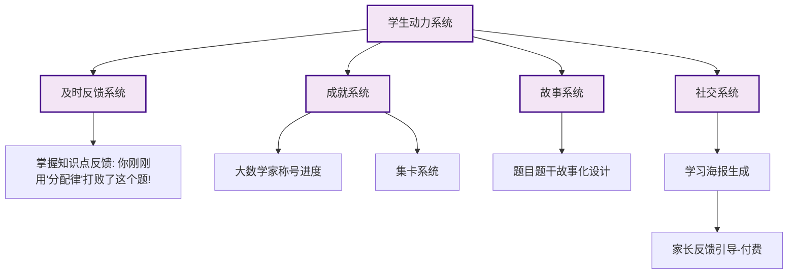
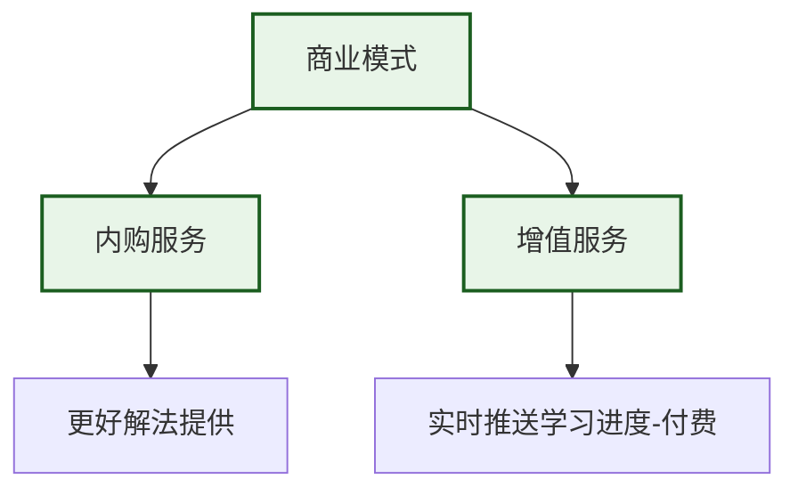
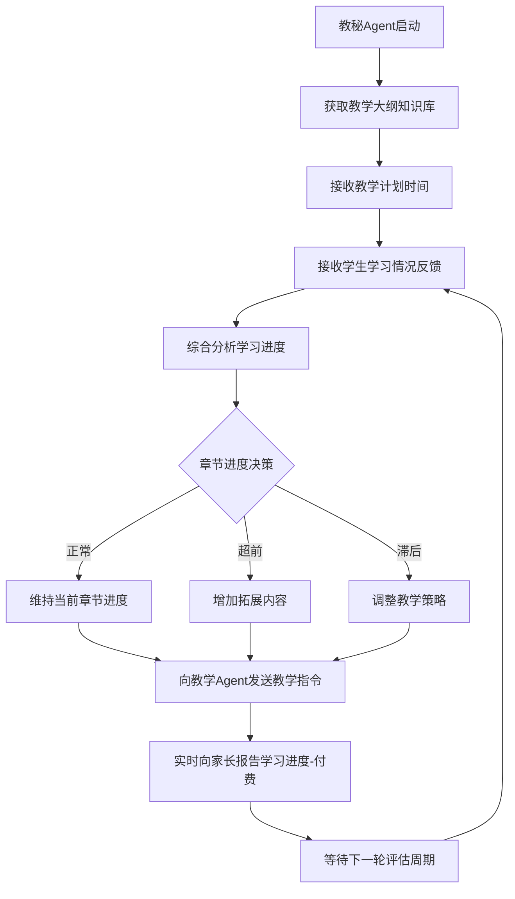
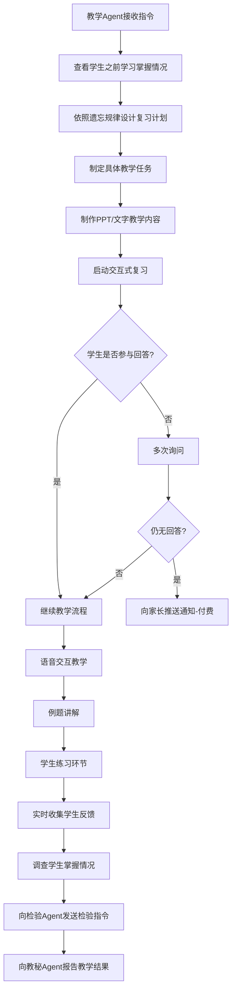
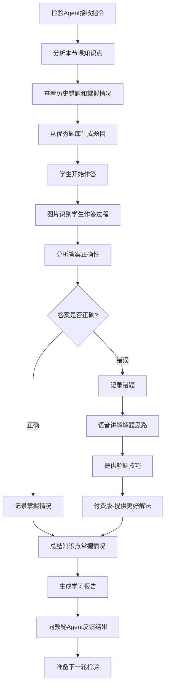
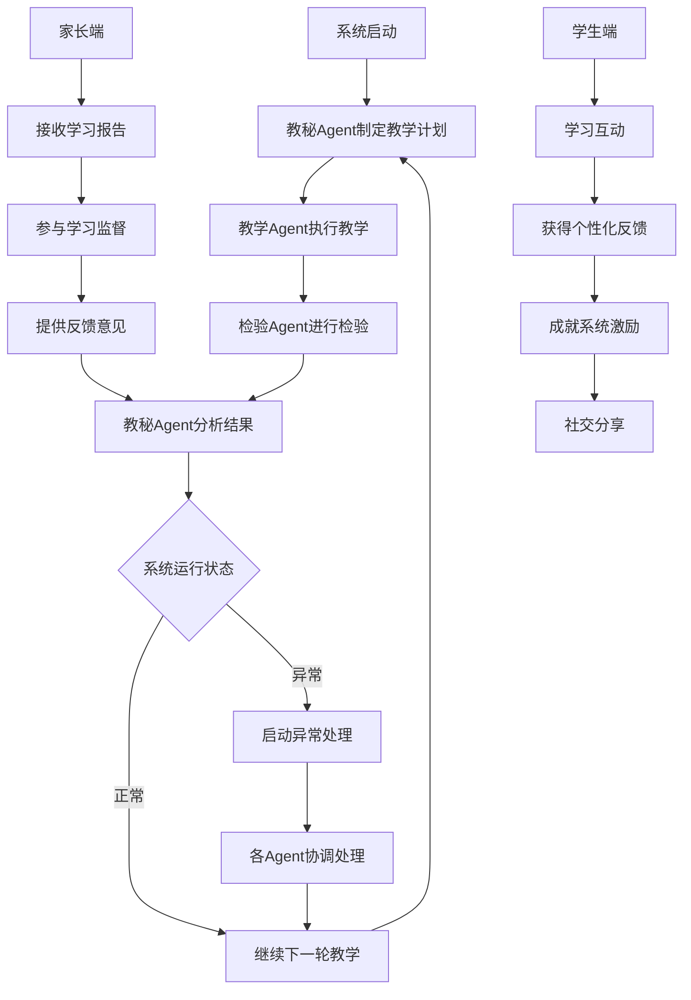
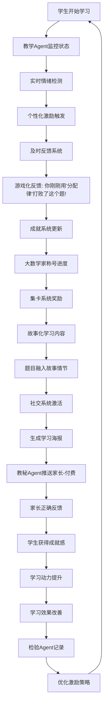
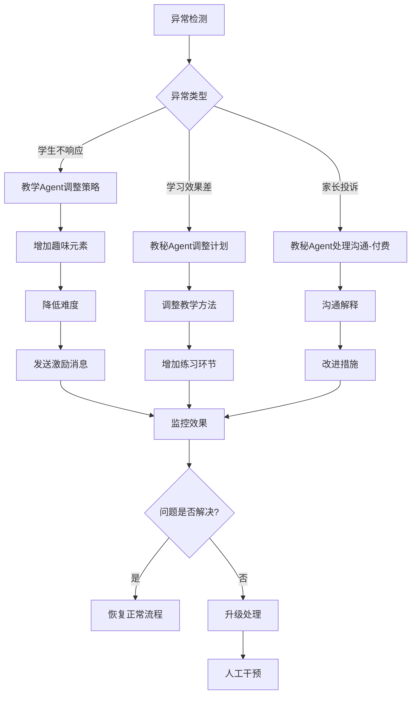

# AI教师系统Agent业务逻辑图（优化版）

## 整体架构总览

### 1. 核心教学流程

### 2. 学生动力系统

### 3. 商业模式

## Agent职责分工

| Agent名称 | 主要职责 | 输入数据 | 输出数据 | 协作对象 |
|-----------|----------|----------|----------|----------|
| **教秘Agent** | 整体教学计划把控、章节进度决策、向家长实时报告 | 教学大纲、教学计划时间、学生学习情况 | 章节进度决策、家长学习进度报告 | 教学、检验 |
| **教学Agent** | 细化章节内容、制定教学任务、交互式教学、例题讲解 | 教学大纲、学生掌握情况 | PPT/文字内容、语音交互、教学反馈 | 教秘、检验 |
| **检验Agent** | 出题检验、图片识别作答、错题分析、知识点总结 | 教学结果、学生作答过程 | 学习报告、错题记录、知识点掌握情况 | 教学、教秘 |

## 1. 教秘Agent（教学计划把控）

## 2. 教学Agent（细化章节内容）

## 3. 检验Agent（出题检验）

## 4. 整体系统协作流程（简化版）

## 5. 学生动力系统（简化版）

## 6. 教学流程监控机制（简化版）

