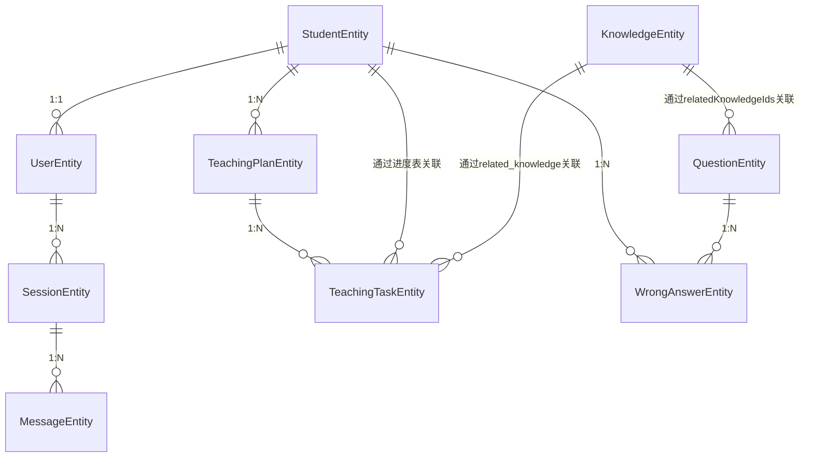

# AI教师应用数据库结构说明

## 概述

AI教师应用使用Room持久化库作为本地数据库解决方案。Room是Android官方推荐的SQLite对象映射库，提供了编译时SQL验证、减少样板代码等优势。

应用数据库分为多个独立的数据库，每个数据库负责特定的数据模块，以保持数据结构的清晰性和可维护性。

## 数据库设计原则

1. **模块化设计**：不同业务模块使用独立的数据库实例
2. **数据规范化**：遵循数据库设计范式，减少数据冗余
3. **关系明确**：通过外键约束明确表间关系
4. **性能优化**：合理使用索引提高查询效率
5. **可扩展性**：设计易于扩展的表结构

## 数据库实例

### 1. AITeacherDatabase（主数据库）

主数据库包含与教学核心功能相关的实体表。

**包含实体**：
- StudentEntity（学生表）
- SessionEntity（会话表）
- MessageEntity（消息表）
- WrongAnswerEntity（错题记录表）
- TeachingPlanEntity（教学计划表）
- TeachingTaskEntity（教学任务表）

### 2. UserDatabase（用户数据库）

用户数据库专门存储用户相关信息。

**包含实体**：
- UserEntity（用户表）

### 3. KnowledgeDatabase（知识数据库）

知识数据库存储知识点相关信息。

**包含实体**：
- KnowledgeEntity（知识点表）

### 4. QuestionDatabase（题目数据库）

题目数据库存储测试题目相关信息。

**包含实体**：
- QuestionEntity（题目表）

## 数据库实体详解

### 1. 用户相关实体

#### UserEntity（用户表）
存储用户基本信息，支持家长和学生两种用户类型。

**字段说明**：
- `userId` (String, 主键) - 用户唯一标识符
- `userType` (UserType) - 用户类型（家长或学生）
- `studentId` (String, 可空) - 学生ID（仅学生用户有效）

#### StudentEntity（学生表）
存储学生的详细信息。

**字段说明**：
- `studentId` (String, 主键) - 学生唯一标识符
- `studentName` (String) - 学生姓名
- `grade` (Int) - 年级
- `currentChapter` (String) - 当前学习章节
- `createdAt` (Long) - 创建时间戳
- `updatedAt` (Long) - 更新时间戳

### 2. 会话相关实体

#### SessionEntity（会话表）
存储用户与AI的会话信息，实现一个用户对应多个会话的关系。

**字段说明**：
- `sessionId` (String, 主键) - 会话唯一标识符
- `userId` (String, 外键) - 关联的用户ID
- `title` (String) - 会话标题
- `createdAt` (Long) - 创建时间戳
- `updatedAt` (Long) - 更新时间戳
- `tags` (List<String>) - 会话标签列表

#### MessageEntity（消息表）
存储会话中的具体消息，实现一个会话对应多条消息的关系。

**字段说明**：
- `messageId` (String, 主键) - 消息唯一标识符
- `sessionId` (String, 外键) - 关联的会话ID
- `role` (String) - 消息角色（user或assistant）
- `content` (String) - 消息内容
- `tokens` (Int) - 消息token数
- `createdAt` (Long) - 创建时间戳
- `metadata` (Map<String, String>) - 消息元数据

### 3. 教学相关实体

#### TeachingPlanEntity（教学计划表）
存储学生的教学计划信息。

**字段说明**：
- `planId` (String, 主键) - 教学计划唯一标识符
- `studentId` (String, 外键) - 关联的学生ID
- `title` (String) - 教学计划标题
- `description` (String) - 教学计划描述
- `subject` (String) - 学科
- `gradeLevel` (String) - 年级水平
- `totalDays` (Int) - 总天数
- `startDate` (String) - 开始日期
- `endDate` (String) - 结束日期
- `status` (String) - 状态（active, completed, paused）
- `createdAt` (Long) - 创建时间戳
- `updatedAt` (Long) - 更新时间戳
- `tags` (List<String>) - 标签列表

#### TeachingTaskEntity（教学任务表）
存储教学计划中的具体任务。

**字段说明**：
- `taskId` (String, 主键) - 教学任务唯一标识符
- `planId` (String, 外键) - 关联的教学计划ID
- `day` (Int) - 第几天
- `date` (String) - 日期
- `title` (String) - 任务标题
- `description` (String) - 任务描述
- `topics` (List<String>) - 主题列表
- `relatedKnowledge` (List<KnowledgeItem>) - 相关知识点列表
- `estimatedTime` (Int) - 预估学习时间（分钟）
- `content` (String) - 任务内容
- `resources` (List<LearningResource>) - 学习资源列表
- `completed` (Boolean) - 是否完成
- `completionDate` (String, 可空) - 完成日期
- `grade` (Int) - 得分
- `maxGrade` (Int) - 最高分
- `createdAt` (Long) - 创建时间戳
- `updatedAt` (Long) - 更新时间戳

#### KnowledgeItem（知识点数据类）
教学任务中相关知识点的数据结构。

**字段说明**：
- `knowledgeId` (String) - 知识点ID
- `topic` (String) - 主题
- `subject` (String) - 学科

#### LearningResource（学习资源数据类）
教学任务中学习资源的数据结构。

**字段说明**：
- `type` (String) - 资源类型
- `url` (String) - 资源链接
- `title` (String) - 资源标题

### 4. 测试评估相关实体

#### QuestionEntity（测试题表）
存储测试题目信息。

**字段说明**：
- `questionId` (String, 主键) - 题目唯一标识符
- `subject` (String) - 学科
- `grade` (Int) - 年级
- `questionText` (String) - 题目内容
- `answer` (String) - 答案
- `questionType` (String) - 题目类型
- `difficulty` (Int) - 难度等级
- `relatedKnowledgeIds` (List<String>) - 关联的知识点ID列表

#### WrongAnswerEntity（错题记录表）
存储学生的错题记录信息。

**字段说明**：
- `id` (Long, 主键, 自增) - 记录唯一标识符
- `studentId` (String, 外键) - 关联的学生ID
- `questionId` (String, 外键) - 关联的题目ID
- `studentAnswer` (String) - 学生答案
- `isCorrect` (Boolean) - 是否正确
- `timeSpent` (Int) - 答题用时（秒）
- `attempt` (Int) - 第几次尝试
- `createdAt` (Long) - 创建时间戳
- `updatedAt` (Long) - 更新时间戳

### 5. 知识相关实体

#### KnowledgeEntity（知识点表）
存储知识点详细信息。

**字段说明**：
- `knowledgeId` (String, 主键) - 知识点唯一标识符
- `subject` (String) - 学科
- `grade` (Int) - 年级
- `chapter` (String) - 章节
- `concept` (String) - 概念描述
- `applicationMethods` (List<String>) - 应用方法列表
- `keywords` (List<String>) - 关键词列表

## 数据库关系图



## 数据访问层

### DAO（数据访问对象）

每个实体都对应一个DAO接口，提供数据访问方法：

1. **UserDao** - 用户数据访问
2. **StudentDao** - 学生数据访问
3. **SessionDao** - 会话数据访问
4. **MessageDao** - 消息数据访问
5. **TeachingPlanDao** - 教学计划数据访问
6. **TeachingTaskDao** - 教学任务数据访问
7. **QuestionDao** - 测试题数据访问
8. **WrongAnswerDao** - 错题记录数据访问
9. **KnowledgeDao** - 知识点数据访问

### Repository（仓库层）

每个DAO都有对应的Repository类，提供业务逻辑封装：

1. **UserRepository** - 用户业务逻辑
2. **StudentRepository** - 学生业务逻辑
3. **SessionRepository** - 会话业务逻辑
4. **MessageRepository** - 消息业务逻辑
5. **TeachingPlanRepository** - 教学计划业务逻辑
6. **TeachingTaskRepository** - 教学任务业务逻辑
7. **QuestionRepository** - 测试题业务逻辑
8. **WrongAnswerRepository** - 错题记录业务逻辑
9. **KnowledgeRepository** - 知识点业务逻辑

## 类型转换器

由于Room原生不支持List、Map等复杂类型，通过Converters类提供类型转换支持：
- List<String> 转换
- Map<String, String> 转换
- List<KnowledgeItem> 转换
- List<LearningResource> 转换
- List<String> 转换（用于QuestionEntity的relatedKnowledgeIds）

## 使用示例

### 插入数据
```kotlin
val student = StudentEntity(
    studentId = "student_001",
    studentName = "张三",
    grade = 7,
    currentChapter = "第一章 有理数",
    createdAt = System.currentTimeMillis(),
    updatedAt = System.currentTimeMillis()
)

studentDao.insertStudent(student)
```

### 查询数据
```kotlin
// 查询学生的所有教学计划
val plans = teachingPlanDao.getTeachingPlansByStudentId("student_001")

// 查询教学计划的所有任务
val tasks = teachingTaskDao.getTeachingTasksByPlanId("plan_001")
```

### 更新数据
```kotlin
val task = teachingTaskDao.getTeachingTaskById("task_001")
task?.copy(completed = true, completionDate = "2025-11-01")
    ?.let { teachingTaskDao.updateTeachingTask(it) }
```

## 总结

当前数据库结构设计合理，遵循了模块化和数据规范化原则，通过外键约束明确了表间关系，支持完整的教学流程管理，包括用户管理、会话管理、教学计划管理、测试评估等功能。整体结构清晰，易于维护和扩展。